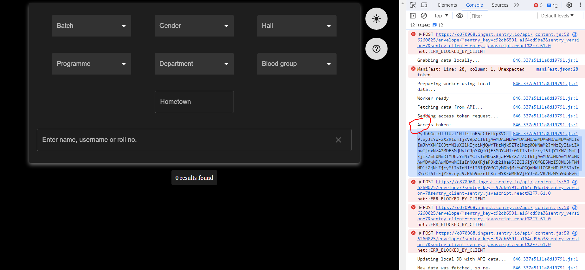
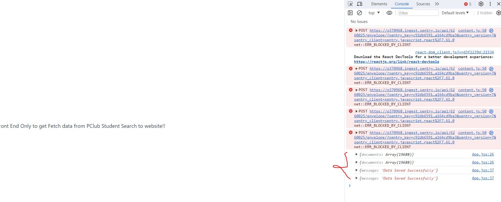

# React + Vite

This template provides a minimal setup to get React working in Vite with HMR and some ESLint rules.

Currently, two official plugins are available:

- [@vitejs/plugin-react](https://github.com/vitejs/vite-plugin-react/blob/main/packages/plugin-react/README.md) uses [Babel](https://babeljs.io/) for Fast Refresh
- [@vitejs/plugin-react-swc](https://github.com/vitejs/vite-plugin-react-swc) uses [SWC](https://swc.rs/) for Fast Refresh

# Format of Data Stored of Y23
    {
        'HallNo' : {
            'Wing':{
                'Room No.' : [
                    {studentOne},
                    {studentTwo}
                ]
            }
        }
    }

# Steps to run :
## Run /backend in one Terminal
1. cd /backend
2. npm install
3. node index.js

## Copy authentication token from PClub Student Search Website

1. Copy token from website in /src/App.jsx in variable named 'token'

## Run FrontEnd to fetch data in another Terminal
1. npm install
2. npm run dev
3. Open website http://localhost:5173/
4. Open console of Browser It takes some time to fetch data: Refresh it if not received <strong>(May take 1-2 min)</strong>

## To test api in Postman
1. Note : /studentSearch endpoint will directly fetch data from PClub Student Search 
            Also fetch data is stored in 'data.json' in backend directory
2. Endpoint: http://localhost:3000/
    Description: Fetch all data 
    Request Type : GET
3. Endpoint: http://localhost:3000/:wing
    Description:  It is used to fetch data from a wing (:wing like A or B or C in <strong>Capital Letters</strong> without string brackets ''). 
    Request Type : GET 
    Params Required: Wing 
    Returns: For each hall it returns student of :wing in format {'Hall' : {'Room No' : [Student Detail]}}
4. Endpoint: /WingiesOrNot It returns whether two people are of same wing or not 
    Request Type : POST 
    Body Required: studentOne and studentTwo which are id's of two student 
                Example: { 
                   "studentOne" : "231110052", 
                    "studentTwo": "231110015" 
                } 
    Returns : <strong>Wingies</strong> if both student are of same wing other <strong>Not Wingies</strong>